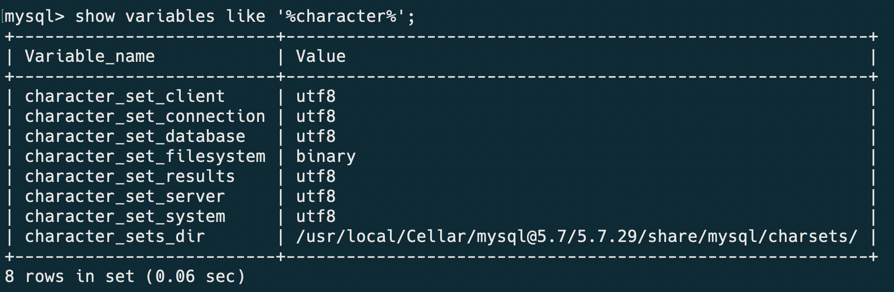
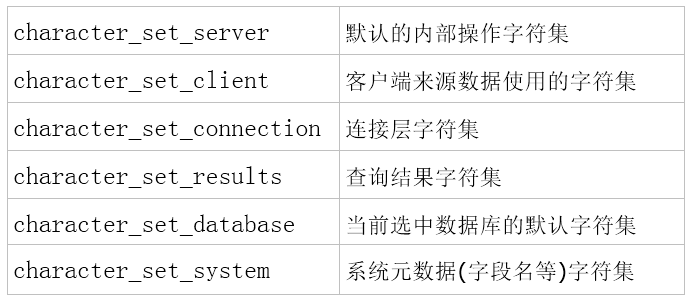
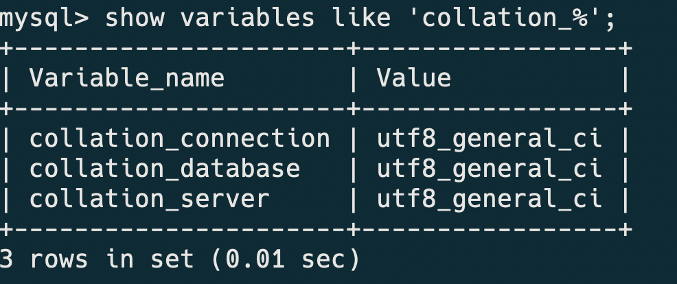

### 字符集和排序规则的理解

---
#### 字符集(Character set)
1. 字符集
是多个字符（英文字符、汉字字符、或者其他国家语言字符）的集合，字符集种类较多，每个字符集包含的字符个数不同。

2. 特点
- 字符编码方式使用一个或多个字节表示字符集中的一个字符
- 每种字符集都有自己特有的编码方式，因此同一个字符，在不同字符集的编码方式下，会产生不同的二进制

3. 常见字符集
- `ASCII`：基于罗马字母表的一套字符集，它采用1个字节的低7位表示字符，高位始终为0。
- `LATIN1`：相对于ASCII字符集做了扩展，仍然使用一个字节表示字符，但启用了高位，扩展了字符集的表示范围。
- `GBK`：支持中文，字符有一字节编码和两字节编码方式。
- `UTF8`：Unicode字符集的一种，是计算机科学领域里的一项业界标准，支持了所有国家的文字字符，utf8采用1-4个字节表示字符。

4. mysql的字符集

5. mysql各个字符集的含义

以上这些参数如何起作用：
- 库、表、列字符集的由来
    - 建库时，若未明确指定字符集，则采用character_set_server指定的字符集。
    - 建表时，若未明确指定字符集，则采用当前库所采用的字符集。
    - 新增时，修改表字段时，若未明确指定字符集，则采用当前表所采用的字符集。

- 更新、查询涉及到得字符集变量
    - 更新流程字符集转换过程：character_set_client-->character_set_connection-->表字符集。
    - 查询流程字符集转换过程：表字符集-->character_set_result

- character_set_database
    - 当前默认数据库的字符集，比如执行use xxx后，当前数据库变为xxx，若xxx的字符集为utf8，那么此变量值就变为utf8(供系统设置，无需人工设置)。

- 客户端使用的字符集必须通过character_set_client、character_set_connection体现出来
    - 在客户端对数据进行编码（Linux：utf8、windows：gbk）
    - MySQL接到SQL语句后(比如insert)，发现有字符，询问客户端通过什么方式对字符编码：客户端通过character_set_client参数告知MySQL客户端的编码方式(所以此参数需要正确反映客户端对应的编码)
    - 当MySQL发现客户端的client所传输的字符集与自己的connection不一样时，会将client的字符集转换为connection的字符集
    - MySQL将转换后的编码存储到MySQL表的列上，在存储的时候再判断编码是否与内部存储字符集（按照优先级判断字符集类型）上的编码一致，如果不一致需要再次转换
    - 客户端使用的字符集必须通过character_set_results来体现，服务器询问客户端字符集，通过character_set_results将结果转换为与客户端相同的字符集传递给客户端。(character_set_results默认等于character_set_client)

---
#### 排序规则(collation)
校对规则(collation)：

1. 校对规则是在字符集内用于字符比较和排序的一套规则，比如有的规则区分大小写，有的则无视。

2. 查看当前数据库支持的排序规则

3. 校对规则特征
    - 两个不同的字符集不能有相同的校对规则；
    - 每个字符集有一个默认校对规则；
    - 存在校对规则命名约定：以其相关的字符集名开始，中间包括一个语言名，并且以_ci（大小写不敏感）、_cs（大小写敏感）或_bin（二元）结束。