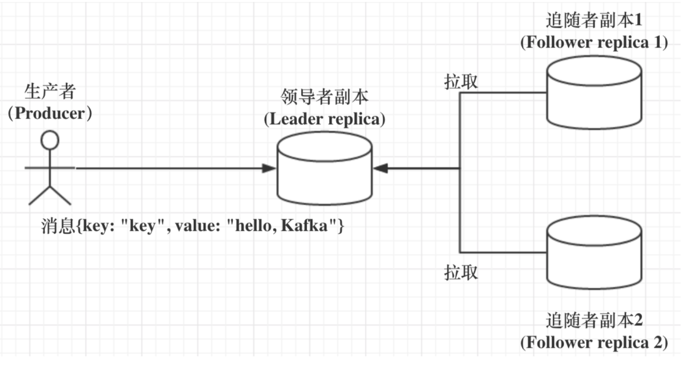

## Kafka副本机制

所谓的副本机制（Replication），也可以称之为备份机制，通常是指分布式系统在多台网络互联的机器上保存有相同的数据拷贝。副本机制有什么**好处**呢？

1. **提供数据冗余**。即使系统部分组件失效，系统依然能够继续运转，因而增加了整体可用性以及数据持久性。
2. **提供高伸缩性**。支持横向扩展，能够通过增加机器的方式来提升读性能，进而提高读操作吞吐量。
3. **改善数据局部性**。允许将数据放入与用户地理位置相近的地方，从而降低系统延时。

**但是有些遗憾的是，对于 Apache Kafka 而言，目前只能享受到副本机制带来的第 1 个好处，也就是提供数据冗余实现高可用性和高持久性。**

### 副本定义

> **所谓副本本质上其实就是一个只能追加写消息的提交日志。**
>
> 一个主题(逻辑定义) --> 若干个分区(物理定义) --> 每个分区有若干个副本(分散在不同的broker)

### 副本机制

Kafka副本是**基于领导者的副本机制**。

1. 在 Kafka 中，副本分成两类：领导者副本（Leader Replica）和追随者副本（Follower Replica）。每个分区在创建时都要选举一个副本，称为领导者副本，其余的副本自动称为追随者副本。

2. Kafka 的副本机制比其他分布式系统要更严格一些。在 Kafka 中，追随者副本是不对外提供服务的。这就是说，任何一个追随者副本都不能响应消费者和生产者的读写请求。所有的请求都必须由领导者副本来处理，或者说，所有的读写请求都必须发往领导者副本所在的 Broker，由该 Broker 负责处理。**追随者副本不处理客户端请求(这也是为什么Kafka副本机制只能享受副本机制的第 1 个好处的根本原因所在)，它唯一的任务就是从领导者副本异步拉取消息**，并写入到自己的提交日志中，从而实现与领导者副本的同步。

3. 当领导者副本挂掉了，或者说领导者副本所在的 Broker 宕机时，Kafka 依托于 ZooKeeper 提供的监控功能能够实时感知到，并立即开启新一轮的领导者选举，从追随者副本中选一个作为新的领导者。老 Leader 副本重启回来后，只能作为追随者副本加入到集群中。

**Kafka的副本机制有什么好处呢？**

1. 方便实现“Read-your-writes”

   所谓 Read-your-writes，顾名思义就是，当你使用生产者 API 向 Kafka 成功写入消息后，使用消费者 API 马上就能够读取到刚才生产的消息。

   举个例子，比如你平时发微博时，你发完一条微博，肯定是希望能立即看到的，这就是典型的 Read-your-writes 场景。如果允许追随者副本对外提供服务，由于副本同步是异步的，因此有可能出现追随者副本还没有从领导者副本那里拉取到最新的消息，从而使得客户端看不到最新写入的消息。

2. 方便实现单调读（Monotonic Reads）

   什么是单调读呢？就是对于一个消费者用户而言，在多次消费消息时，它不会看到某条消息一会儿存在一会儿不存在。

   如果允许追随者副本提供读服务，那么假设当前有 2 个追随者副本 F1 和 F2，它们异步地拉取领导者副本数据。倘若 F1 拉取了 Leader 的最新消息而 F2 还未及时拉取，那么，此时如果有一个消费者先从 F1 读取消息之后又从 F2 拉取消息，它可能会看到这样的现象：第一次消费时看到的最新消息在第二次消费时不见了，这就不是单调读一致性。但是，如果所有的读请求都是由 Leader 来处理，那么 Kafka 就很容易实现单调读一致性。

### ISR(In-sync Replicas)

ISR 副本集合。ISR 中的副本都是与 Leader 同步的副本，相反，不在 ISR 中的追随者副本就被认为是与 Leader 不同步的。

我们首先要明确的是，Leader 副本天然就在 ISR 中。也就是说，**ISR 不只是追随者副本集合，它必然包括 Leader 副本。甚至在某些情况下，ISR 只有 Leader 这一个副本**。

那么，到底什么副本能够进入到 ISR 中呢？

> **这个标准就是 Broker 端参数 replica.lag.time.max.ms 参数值**。这个参数的含义是 Follower 副本能够落后 Leader 副本的最长时间间隔，当前默认值是 10 秒。这就是说，只要一个 Follower 副本落后 Leader 副本的时间不连续超过 10 秒，那么 Kafka 就认为该 Follower 副本与 Leader 是同步的，即使此时 Follower 副本中保存的消息明显少于 Leader 副本中的消息。
>
> 我们在前面说过，Follower 副本唯一的工作就是不断地从 Leader 副本拉取消息，然后写入到自己的提交日志中。如果这个同步过程的速度持续慢于 Leader 副本的消息写入速度，那么在 replica.lag.time.max.ms 时间后，此 Follower 副本就会被认为是与 Leader 副本不同步的，因此不能再放入 ISR 中。此时，Kafka 会自动收缩 ISR 集合，将该副本“踢出”ISR。
>
> 值得注意的是，倘若该副本后面慢慢地追上了 Leader 的进度，那么它是能够重新被加回 ISR 的。这也表明，ISR 是一个动态调整的集合，而非静态不变的。

###  Unclean 领导者选举（Unclean Leader Election）

当ISR中只有一个领导者副本时，且此领导者副本也“挂掉了”，此时Kafka需要重新选举一个领导者副本时，Kafka是怎么选举新的Leader副本的呢？

> **Kafka 把所有不在 ISR 中的存活副本都称为非同步副本**。通常来说，非同步副本落后 Leader 太多，因此，如果选择这些副本作为新 Leader，就可能出现数据的丢失。毕竟，这些副本中保存的消息远远落后于老 Leader 中的消息。在 Kafka 中，选举这种副本的过程称为 Unclean 领导者选举。**Broker 端参数 unclean.leader.election.enable 控制是否允许 Unclean 领导者选举**。
>
> 开启 Unclean 领导者选举可能会造成数据丢失，但好处是，它使得分区 Leader 副本一直存在，不至于停止对外提供服务，因此提升了高可用性。反之，禁止 Unclean 领导者选举的好处在于维护了数据的一致性，避免了消息丢失，但牺牲了高可用性。
>
> 你可以根据你的实际业务场景决定是否开启 Unclean 领导者选举。不过，我强烈建议你**不要**开启它，毕竟我们还可以通过其他的方式来提升高可用性。如果为了这点儿高可用性的改善，牺牲了数据一致性，那就非常不值当了。

