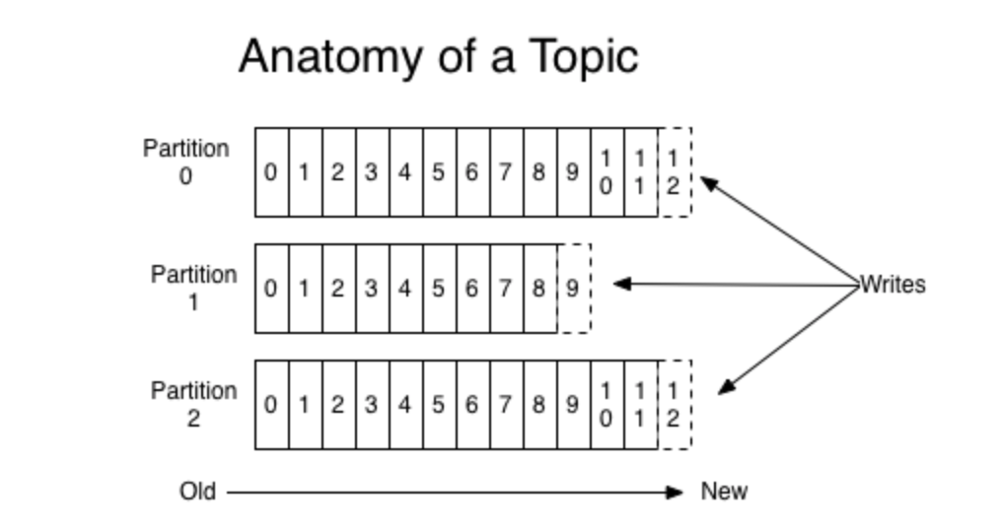

## kafka简介

### 消息引擎的主要作用

- 传输的对象是消息

  - kafka使用的是纯二进制的字节序列

- 如何传输消息

  kafka使用以下2种传输类型

  - 点对点模型
  - 发布/订阅模型

### 使用消息引擎的好处

- 削峰填谷
  - 缓冲上下游瞬时突发流量，使其更平滑
- 应用间解耦
  - 使发送方和接收方的解耦，在一定程度上简化了应用的开发，减少了系统间不必要的交互

### 如何达到kafka高可用

- 搭建kafka集群
- 备份机制

### kafka术语

- Record（消息）：kafka 是消息引擎，这里的消息就是指 Kafka 处理的主要对象

- Topic（主题）：主题是承载消息的逻辑容器，在实际使用中多用来区分具体的业务

- Producer（生产者）：向主题发布消息的客户端应用程序。生产者通常持续不断的向一个或多个主题发送消息

- Consumer（消费者）：订阅主题消息的客户端应用程序。消费者可以订阅一个或多个主题的消息

  我们把生产者和消费者统称为**客户端（Clients）**

- Broker（代理）: 服务器端。一个 Kafka 集群由多个 Broker 组成，Broker 负责接收和处理客户端发送过来的请求，以及对消息进行持久化

- Replica（副本）：领导者副本（Leader Replica）和追随者副本（Follower Replica）。前者对外提供服务，这里的对外指的是与客户端程序进行交互；而后者只是被动地追随领导者副本而已，不能与外界进行交互

- Partitioning（分区）：将每个主题划分成多个分区（Partition），每个分区是一组有序的消息日志。生产者生产的每条消息只会被发送到一个分区中，也就是说如果向一个双分区的主题发送一条消息，这条消息要么在分区 0 中，要么在分区 1 中。kafka 的分区编号是从 0 开始的，如果 Topic 有 100 个分区，那么它们的分区号就是从 0 到 99

  **副本**是在**分区**这个层级定义的。每个分区下可以配置若干个副本，其中只能有 1 个领导者副本和 N-1 个追随者副本

- Offset（位移）：生产者向分区写入消息，每条消息在分区中的位置信息由一个叫位移的数据来表征。分区位移总是从 0 开始，假设一个生产者向一个空分区写入了 10 条消息，那么这 10 条消息的位移依次是 0、1、2、…、9

- Consumer Offset（消费者位移）：表征消费者消费进度，每个消费者都有自己的消费者位移

- Consumer Group（消费者组）：多个消费者实例共同组成的一个组，同时消费多个分区以实现高吞吐

- Rebalance（重平衡）：消费者组内某个消费者实例挂掉后，其他消费者实例自动重新分配订阅主题分区的过程。Rebalance 是 Kafka 消费者端实现高可用的重要手段

### kafka 的三层消息架构

- 第一层是主题层，每个主题可以配置 M 个分区，而每个分区又可以配置 N 个副本

- 第二层是分区层，每个分区的 N 个副本中只能有一个充当领导者角色，对外提供服务；其他 N-1 个副本是追随者副本，只是提供数据冗余之用

- 第三层是消息层，分区中包含若干条消息，每条消息的位移从 0 开始，依次递增

  最后，客户端程序只能与分区的领导者副本进行交互

### 持久化文件

一个 Topic 被分成多 Partition，每个 Partition 在存储层面是一个 append-only 日志文件，属于一个 Partition 的消息都会被直接追加到日志文件的尾部，每条消息在文件中的位置称为 offset（偏移量）。



日志文件由“日志条目（log entries）”序列组成，每一个日志条目包含一个4字节整型数（值为N），其后跟N个字节的消息体。每条消息都有一个当前 Partition 下唯一的64字节的 offset，标识这条消息的起始位置。消息格式如下：

```
On-disk format of a message

offset         : 8 bytes 
message length : 4 bytes (value: 4 + 1 + 1 + 8(if magic value > 0) + 4 + K + 4 + V)
crc            : 4 bytes
magic value    : 1 byte
attributes     : 1 byte
timestamp      : 8 bytes (Only exists when magic value is greater than zero)
key length     : 4 bytes
key            : K bytes
value length   : 4 bytes
value          : V bytes
```

