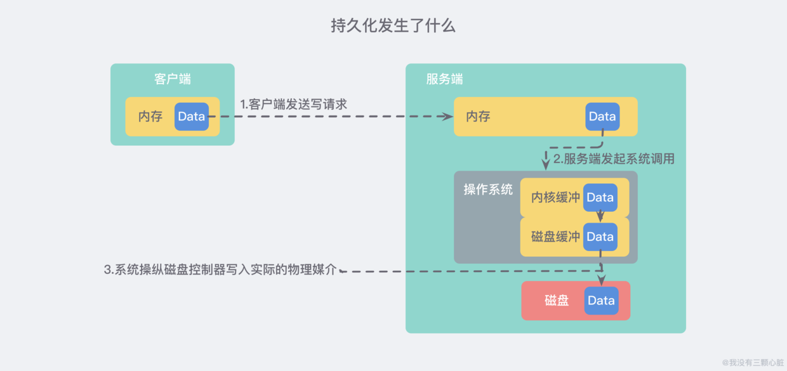

### 持久化过程

大概就是下面这样：
- 客户端向数据库 发送写命令 (数据在客户端的内存中)
- 数据库 接收 到客户端的 写请求 (数据在服务器的内存中)
- 数据库 调用系统 API 将数据写入磁盘 (数据在内核缓冲区中)
- 操作系统将 写缓冲区 传输到 磁盘控控制器 (数据在磁盘缓存中)
- 操作系统的磁盘控制器将数据 写入实际的物理媒介 中 (数据在磁盘中)

注意: 上面的过程其实是 极度精简 的，在实际的操作系统中，缓存 和 缓冲区 会比这 多得多...

### aof（追加文件）
与快照持久化相⽐，AOF持久化 的实时性更好，因此已成为主流的持久化⽅案。默认情况下Redis没有开启AOF（append only file）⽅式的持久化，可以通过appendonly参数开启：`appendonly yes`。开启AOF持久化后每执⾏⼀条会更改Redis中的数据的命令，Redis就会将该命令写⼊硬盘中的AOF⽂件。AOF⽂件的保存位置和RDB⽂件的位置相同，都是通过dir参数设置的，默认的⽂件名是`appendonly.aof`。

### rdb（快照）
Redis可以通过创建快照来获得存储在内存⾥⾯的数据在某个时间点上的副本。Redis创建快照之后，可以对快照进⾏备份，可以将快照复制到其他服务器从⽽创建具有相同数据的服务器副本（Redis主从结构，主要⽤来提⾼Redis性能），还可以将快照留在原地以便重启服务器的时候使⽤。快照持久化是Redis默认采⽤的持久化⽅式。

### 混合持久化
Redis 4.0 开始⽀持 RDB 和 AOF 的混合持久化（默认关闭，可以通过配置项 `aof-use-rdbpreamble` 开启）。如果把混合持久化打开，AOF 重写的时候就直接把 RDB 的内容写到 AOF ⽂件开头。这样做的好处是可以结合 RDB 和 AOF 的优点, 快速加载同时避免丢失过多的数据。当然缺点也是有的， AOF ⾥⾯的RDB 部分是压缩格式不再是 AOF 格式，可读性差。

### 补充内容：AOF 重写
AOF重写可以产⽣⼀个新的AOF⽂件，这个新的AOF⽂件和原有的AOF⽂件所保存的数据库状态⼀样，但体积更⼩。AOF重写是⼀个有歧义的名字，该功能是通过读取数据库中的键值对来实现的，程序⽆须对现有AOF⽂件进⾏任何读⼊、分析或者写⼊操作。在执⾏ BGREWRITEAOF 命令时，Redis 服务器会维护⼀个 AOF 重写缓冲区，该缓冲区会在⼦进程创建新AOF⽂件期间，记录服务器执⾏的所有写命令。当⼦进程完成创建新AOF⽂件的⼯作之后，服务器会将
重写缓冲区中的所有内容追加到新AOF⽂件的末尾，使得新旧两个AOF⽂件所保存的数据库状态⼀致。最后，服务器⽤新的AOF⽂件替换旧的AOF⽂件，以此来完成AOF⽂件重写操作更多。