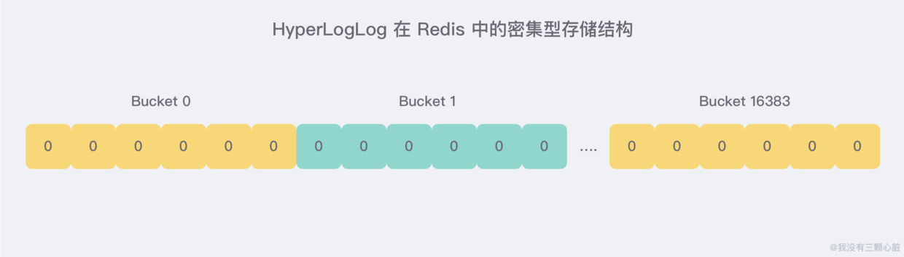
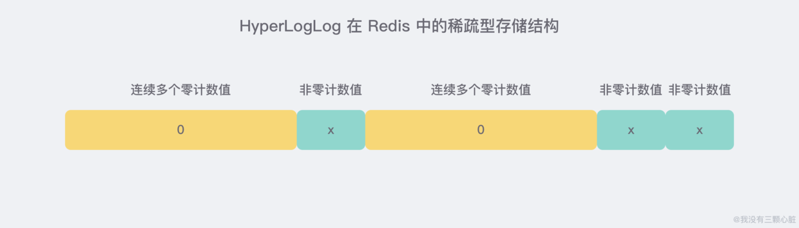

### redis 常⻅数据结构以及使⽤场景分析
#### String
常⽤命令: set,get,decr,incr,mget 等。
String数据结构是简单的key-value类型，value其实不仅可以是String，也可以是数字。 常规key￾value缓存应⽤； 常规计数：微博数，粉丝数等。

#### Hash
常⽤命令： hget,hset,hgetall 等。
hash 是⼀个 string 类型的 field 和 value 的映射表，hash 特别适合⽤于存储对象，后续操作的时候，你可以直接仅仅修改这个对象中的某个字段的值。 ⽐如我们可以 hash 数据结构来存储⽤户信息，商品信息等等

#### List
常⽤命令: lpush,rpush,lpop,rpop,lrange等
list 就是链表，Redis list 的应⽤场景⾮常多，也是Redis最重要的数据结构之⼀，⽐如微博的关注列表，粉丝列表，消息列表等功能都可以⽤Redis的 list 结构来实现。
Redis list 的实现为⼀个双向链表，即可以⽀持反向查找和遍历，更⽅便操作，不过带来了部分额外的内存开销。
另外可以通过 lrange 命令，就是从某个元素开始读取多少个元素，可以基于 list 实现分⻚查询，这个很棒的⼀个功能，基于 redis 实现简单的⾼性能分⻚，可以做类似微博那种下拉不断分⻚的东⻄（⼀⻚⼀⻚的往下⾛），性能⾼。

#### Set
常⽤命令： sadd,spop,smembers,sunion 等
set 对外提供的功能与list类似是⼀个列表的功能，特殊之处在于 set 是可以⾃动排重的。
当你需要存储⼀个列表数据，⼜不希望出现重复数据时，set是⼀个很好的选择，并且set提供了判断某个成员是否在⼀个set集合内的重要接⼝，这个也是list所不能提供的。可以基于 set 轻易实现交集、并集、差集的操作。
⽐如：在微博应⽤中，可以将⼀个⽤户所有的关注⼈存在⼀个集合中，将其所有粉丝存在⼀个集合。
Redis可以⾮常⽅便的实现如共同关注、共同粉丝、共同喜好等功能。这个过程也就是求交集的过程，具体命令如下：sinterstore key1 key2 key3 将交集存在key1内

#### Sorted Set
常⽤命令： zadd,zrange,zrem,zcard等 
和set相⽐，sorted set增加了⼀个权重参数score，使得集合中的元素能够按score进⾏有序排列。
举例： 在直播系统中，实时排⾏信息包含直播间在线⽤户列表，各种礼物排⾏榜，弹幕消息（可以理解为按消息维度的消息排⾏榜）等信息，适合使⽤ Redis 中的 Sorted Set 结构进⾏存储。

#### Geo
常用命令：geoadd,geodist,georadius,georadiusbymember等
用来存储经纬度信息。在 Redis 中，经纬度使用 52 位的整数进行编码，放进了 zset 里面，zset 的 value 是元素的 key，score 是 GeoHash 的 52 位整数值。zset 的 score 虽然是浮点数，但是对于 52 位的整数值来说，它可以无损存储。
在使用 Redis 进行 Geo 查询 时，我们要时刻想到它的内部结构实际上只是一个 zset(skiplist跳表)。通过 zset 的 score 排序就可以得到坐标附近的其他元素 (实际情况要复杂一些，不过这样理解足够了)，通过将 score 还原成坐标值就可以得到元素的原始坐标了。
注意事项：在一个地图应用中，车的数据、餐馆的数据、人的数据可能会有百万千万条，如果使用 Redis 的 Geo 数据结构，它们将 全部放在一个 zset 集合中。在 Redis 的集群环境中，集合可能会从一个节点迁移到另一个节点，如果单个 key 的数据过大，会对集群的迁移工作造成较大的影响，在集群环境中单个 key 对应的数据量不宜超过 1M，否则会导致集群迁移出现卡顿现象，影响线上服务的正常运行。
所以，这里建议 Geo 的数据使用 单独的 Redis 实例部署，不使用集群环境。
如果数据量过亿甚至更大，就需要对 Geo 数据进行拆分，按国家拆分、按省拆分，按市拆分，在人口特大城市甚至可以按区拆分。这样就可以显著降低单个 zset 集合的大小。
举例：查询用户附近最近的商家；附近的人等。

#### HyperLogLog
常用命令：pdadd,pfcount,pfmerge。
一个 HyperLogLog 实际占用的空间大约是 12 KB，但 Redis 对于内存的优化非常变态，当 计数比较小 的时候，大多数桶的计数值都是 零，这个时候 Redis 就会适当节约空间，转换成另外一种 稀疏存储方式，与之相对的，正常的存储模式叫做 密集存储，这种方式会恒定地占用 12 KB。

密集存储：

稀疏存储：

举例：常用来存储不重复数据，比如PV，UV，某个页面等访问人等。