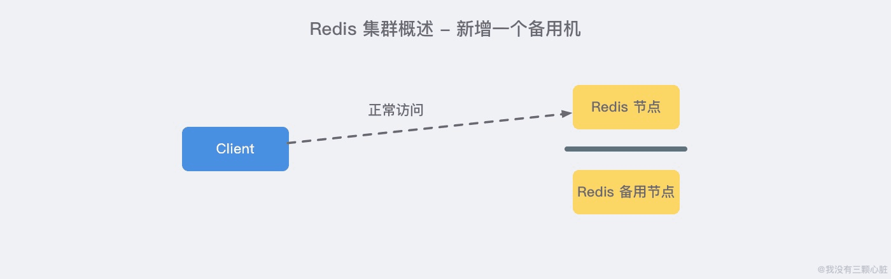

### 主从复制
主从复制，是指将一台 Redis 服务器的数据，复制到其他的 Redis 服务器。前者称为 主节点(master)，后者称为 从节点(slave)。且数据的复制是 单向 的，只能由主节点到从节点。Redis 主从复制支持 主从同步 和 从从同步 两种，后者是 Redis 后续版本新增的功能，以减轻主节点的同步负担。

主从复制主要的作用：
- 数据冗余： 主从复制实现了数据的热备份，是持久化之外的一种数据冗余方式。
- 故障恢复： 当主节点出现问题时，可以由从节点提供服务，实现快速的故障恢复 (实际上是一种服务的冗余)。
- 负载均衡： 在主从复制的基础上，配合读写分离，可以由主节点提供写服务，由从节点提供读服务 （即写 Redis 数据时应用连接主节点，读 Redis 数据时应用连接从节点），分担服务器负载。尤其是在写少读多的场景下，通过多个从节点分担读负载，可以大大提高 Redis 服务器的并发量。
- 高可用基石： 除了上述作用以外，主从复制还是哨兵和集群能够实施的 基础，因此说主从复制是 Redis 高可用的基础。



### Redis Sentinel 哨兵


上图 展示了一个典型的哨兵架构图，它由两部分组成，哨兵节点和数据节点：
- 哨兵节点： 哨兵系统由一个或多个哨兵节点组成，哨兵节点是特殊的 Redis 节点，不存储数据；
- 数据节点： 主节点和从节点都是数据节点；
在复制的基础上，哨兵实现了 自动化的故障恢复 功能，下方是官方对于哨兵功能的描述：

- 监控（Monitoring）： 哨兵会不断地检查主节点和从节点是否运作正常。
- 自动故障转移（Automatic failover）： 当 主节点 不能正常工作时，哨兵会开始 自动故障转移操作，它会将失效主节点的其中一个 从节点升级为新的主节点，并让其他从节点改为复制新的主节点。
- 配置提供者（Configuration provider）： 客户端在初始化时，通过连接哨兵来获得当前 Redis 服务的主节点地址。
- 通知（Notification）： 哨兵可以将故障转移的结果发送给客户端。
其中，监控和自动故障转移功能，使得哨兵可以及时发现主节点故障并完成转移。而配置提供者和通知功能，则需要在与客户端的交互中才能体现。

简单来说 Sentinel 使用以下规则来选择新的主服务器：
1. 在失效主服务器属下的从服务器当中， 那些被标记为主观下线、已断线、或者最后一次回复 PING 命令的时间大于五秒钟的从服务器都会被 淘汰。
2. 在失效主服务器属下的从服务器当中， 那些与失效主服务器连接断开的时长超过 down-after 选项指定的时长十倍的从服务器都会被 淘汰。
3. 在 经历了以上两轮淘汰之后 剩下来的从服务器中， 我们选出 复制偏移量（replication offset）最大 的那个 从服务器 作为新的主服务器；如果复制偏移量不可用，或者从服务器的复制偏移量相同，那么 带有最小运行 ID 的那个从服务器成为新的主服务器。

### Redis集群

上图 展示了 Redis Cluster 典型的架构图，集群中的每一个 Redis 节点都 互相两两相连，客户端任意 直连 到集群中的 任意一台，就可以对其他 Redis 节点进行 读写 的操作。


Redis 集群中内置了 16384 个哈希槽。当客户端连接到 Redis 集群之后，会同时得到一份关于这个 集群的配置信息，当客户端具体对某一个 key 值进行操作时，会计算出它的一个 Hash 值，然后把结果对 16384 求余数，这样每个 key 都会对应一个编号在 0-16383 之间的哈希槽，Redis 会根据节点数量 大致均等 的将哈希槽映射到不同的节点。

再结合集群的配置信息就能够知道这个 key 值应该存储在哪一个具体的 Redis 节点中，如果不属于自己管，那么就会使用一个特殊的 MOVED 命令来进行一个跳转，告诉客户端去连接这个节点以获取数据：

```shell
GET x
-MOVED 3999 127.0.0.1:6381
```

MOVED 指令第一个参数 3999 是 key 对应的槽位编号，后面是目标节点地址，MOVED 命令前面有一个减号，表示这是一个错误的消息。客户端在收到 MOVED 指令后，就立即纠正本地的 槽位映射表，那么下一次再访问 key 时就能够到正确的地方去获取了。

集群的主要作用:
- 数据分区： 数据分区 (或称数据分片) 是集群最核心的功能。集群将数据分散到多个节点，一方面 突破了 Redis 单机内存大小的限制，存储容量大大增加；另一方面 每个主节点都可以对外提供读服务和写服务，大大提高了集群的响应能力。Redis 单机内存大小受限问题，在介绍持久化和主从复制时都有提及，例如，如果单机内存太大，bgsave 和 bgrewriteaof 的 fork 操作可能导致主进程阻塞，主从环境下主机切换时可能导致从节点长时间无法提供服务，全量复制阶段主节点的复制缓冲区可能溢出……
- 高可用： 集群支持主从复制和主节点的 自动故障转移 （与哨兵类似），当任一节点发生故障时，集群仍然可以对外提供服务。
